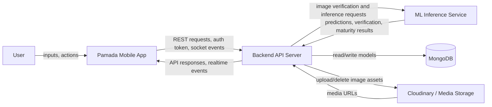
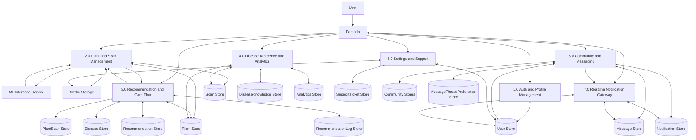
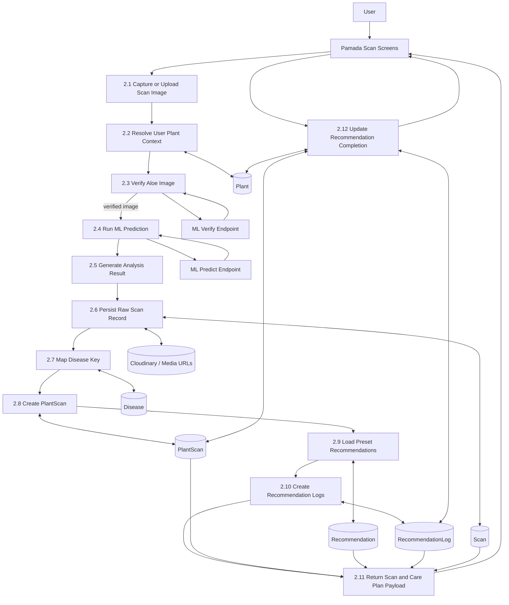
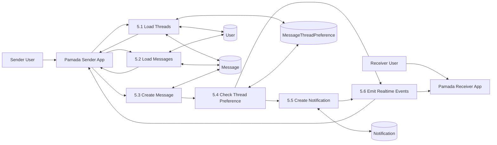
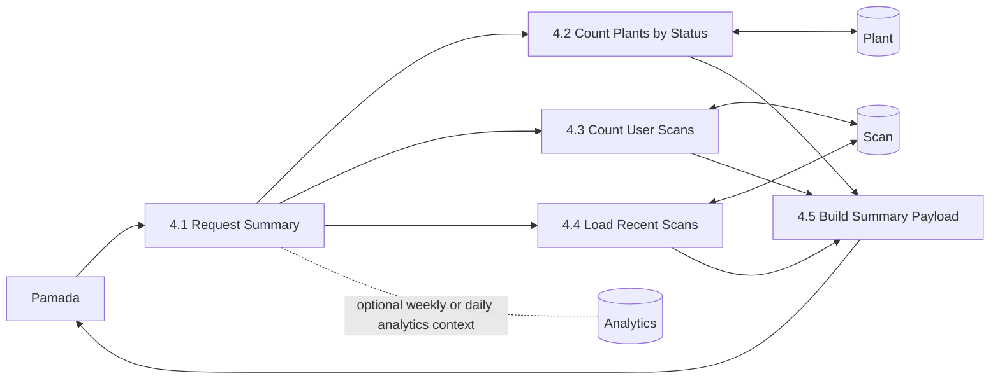

# Data Flow Diagram

## Purpose

This document describes the system using Data Flow Diagram levels 1 to 3.

Scope:

- `Pamada` mobile app
- `backend` API server
- `ml-inference-service`
- MongoDB data stores represented by backend models

The diagrams are written in Mermaid so they can be rendered directly in Markdown viewers that support Mermaid.

## DFD notation used here

- External Entity: actor or external system interacting with the backend
- Process: transformation or business logic step
- Data Store: persisted collection or storage concept
- Data Flow: payload moving between entities, processes, and stores

## Level 1 DFD

Level 1 shows the major subsystems and the highest-level data movement.

## Level 1 explanation

At the highest level:

- the user interacts only with `Pamada`
- `Pamada` talks to `backend`
- `backend` is the only layer that reads or writes MongoDB
- `backend` also calls `ml-inference-service` during scan-related workflows
- media assets are uploaded through backend to Cloudinary-style storage and then referenced from database documents

## Level 2 DFD

<!-- [MermaidChart: 08037143-20f3-495e-8914-3595314e7539] -->
Level 2 breaks the backend into its main functional domains.

<!-- [MermaidChart: 08037143-20f3-495e-8914-3595314e7539] -->

## Level 2 process descriptions

### `1.0 Auth and Profile Management`

Handles:

- registration
- login
- current user lookup
- profile updates
- password updates

Primary store:

- `User`

### `2.0 Plant and Scan Management`

Handles:

- plant creation and retrieval
- scan upload
- scan preview analysis
- scan confirmation
- live detection
- scan history retrieval

Primary stores:

- `Plant`
- `Scan`

External dependency:

- `ml-inference-service`

### `3.0 Recommendation and Care Plan`

Handles:

- disease key mapping
- structured recommendation generation
- care-plan persistence
- recommendation completion tracking

Primary stores:

- `PlantScan`
- `Disease`
- `Recommendation`
- `RecommendationLog`

### `4.0 Disease Reference and Analytics`

Handles:

- disease catalog retrieval
- disease treatment reference
- analytics summary
- weekly analytics

Primary stores:

- `DiseaseKnowledge`
- `Analytics`
- also reads `Plant` and `Scan`

### `5.0 Community and Messaging`

Handles:

- posts
- comments
- likes
- public profile viewing
- direct messages
- thread preferences
- notification creation from community events

Primary stores:

- `CommunityPost`
- `CommunityComment`
- `CommunityLike`
- `CommunityCommentLike`
- `Message`
- `MessageThreadPreference`
- `Notification`
- also reads `User`

### `6.0 Settings and Support`

Handles:

- account settings
- avatar and cover upload
- notification settings
- privacy settings
- support ticket creation and listing

Primary stores:

- `User`
- `SupportTicket`

### `7.0 Realtime Notification Gateway`

Handles:

- socket authentication
- message push
- typing indicators
- notification push
- community realtime events

Primary stores read for context:

- `User`
- `Notification`
- `Message`

## Level 3 DFD

Level 3 goes deeper into the most important operational flow: scanning, disease mapping, and recommendation generation.

## Level 3 explanation: scan and care plan flow

### `2.1 Capture or Upload Scan Image`

The user takes or selects an image in `Pamada`.

### `2.2 Resolve User Plant Context`

Backend finds the target plant by:

- provided plant ID
- existing latest plant
- or auto-created plant record if needed

### `2.3 Verify Aloe Image`

Backend sends the image to the aloe verification endpoint of `ml-inference-service`.

Output:

- is this image really Aloe Vera
- confidence and verification metadata

### `2.4 Run ML Prediction`

Backend sends the verified image to the prediction endpoint for:

- object detections
- visual features
- age estimation
- confidence score

### `2.5 Generate Analysis Result`

Backend transforms ML output into application-facing analysis:

- disease detected or not
- maturity stage
- health score
- estimated days to harvest
- recommendation hints

### `2.6 Persist Raw Scan Record`

Backend stores the scan and media references into `Scan`.

Stored data includes:

- image URLs
- YOLO predictions
- visual features
- analysis result
- scan metadata

### `2.7 Map Disease Key`

Backend normalizes the disease key and resolves it against the `Disease` store.

### `2.8 Create PlantScan`

Backend creates a structured `PlantScan` record tied to:

- user
- plant
- disease
- confidence
- severity
- legacy `Scan`

### `2.9 Load Preset Recommendations`

Backend reads `Recommendation` rows for the resolved disease.

### `2.10 Create Recommendation Logs`

Backend creates `RecommendationLog` rows so each recommendation has a per-scan completion state.

### `2.11 Return Scan and Care Plan Payload`

Backend returns:

- scan record
- disease
- confidence
- severity
- recommendation payload
- progress metadata

### `2.12 Update Recommendation Completion`

When the user marks an item complete:

- backend updates `RecommendationLog`
- backend recomputes care-plan completion on `PlantScan`
- backend may improve `Plant.current_status` when all required actions are complete

## Alternate Level 3 flow: community messaging

This is the second most important interactive flow in the system.

## Alternate Level 3 flow: analytics summary

## Data stores involved in the system

### Core stores

- `User`
- `Plant`
- `Scan`
- `PlantScan`
- `Disease`
- `Recommendation`
- `RecommendationLog`

### Reference and reporting stores

- `DiseaseKnowledge`
- `Analytics`

### Social and communication stores

- `CommunityPost`
- `CommunityComment`
- `CommunityLike`
- `CommunityCommentLike`
- `Message`
- `MessageThreadPreference`
- `Notification`

### Support store

- `SupportTicket`

## Summary

The shortest useful reading of the DFD is:

- `Pamada` is the only user-facing client
- `backend` is the orchestration layer
- `ml-inference-service` is a compute service, not a persistence layer
- MongoDB models are organized around identity, plant scanning, recommendations, community, analytics, and support
- the deepest operational path in the system is the scan-to-recommendation workflow

## Source alignment

This document aligns with:

- [docs/ModelUsage.md](/e:/MELVIN%20FOLDER/Aloe%20Vera/docs/ModelUsage.md)
- [docs/SchemaDiagram.md](/e:/MELVIN%20FOLDER/Aloe%20Vera/docs/SchemaDiagram.md)
- [backend/server.js](/e:/MELVIN%20FOLDER/Aloe%20Vera/backend/server.js)
- [backend/controllers/scanController.js](/e:/MELVIN%20FOLDER/Aloe%20Vera/backend/controllers/scanController.js)
- [backend/services/scanAnalysisService.js](/e:/MELVIN%20FOLDER/Aloe%20Vera/backend/services/scanAnalysisService.js)
- [backend/services/presetRecommendationService.js](/e:/MELVIN%20FOLDER/Aloe%20Vera/backend/services/presetRecommendationService.js)
- [backend/controllers/communityController.js](/e:/MELVIN%20FOLDER/Aloe%20Vera/backend/controllers/communityController.js)
- [backend/controllers/analyticsController.js](/e:/MELVIN%20FOLDER/Aloe%20Vera/backend/controllers/analyticsController.js)
- [Pamada/src/contexts/AppDataContext.js](/e:/MELVIN%20FOLDER/Aloe%20Vera/Pamada/src/contexts/AppDataContext.js)
- [Pamada/src/contexts/RealtimeContext.js](/e:/MELVIN%20FOLDER/Aloe%20Vera/Pamada/src/contexts/RealtimeContext.js)
- [ml-inference-service/app.py](/e:/MELVIN%20FOLDER/Aloe%20Vera/ml-inference-service/app.py)
