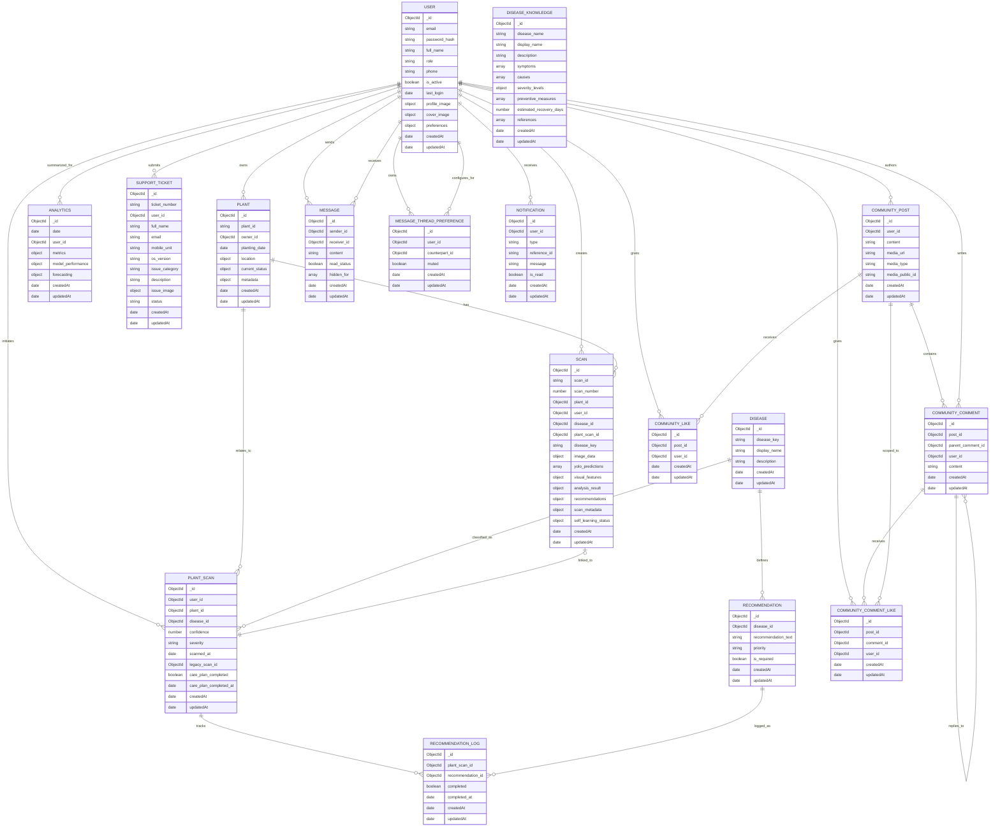

# Document Schema Diagram

## Purpose

This document provides a schema-level view of the database models that are actively utilized by the current whole system:

- `backend`
- `Pamada`
- `ml-inference-service` through backend scan flows

This diagram is based on [docs/ModelUsage.md](/e:/MELVIN%20FOLDER/Aloe%20Vera/docs/ModelUsage.md) and focuses on document relationships, ownership, and the main references between collections.

## Mermaid ER Diagram

## Reading guide

### Identity and ownership

- `User` is the root identity document for most flows.
- `Plant`, `Scan`, `PlantScan`, `Analytics`, `SupportTicket`, `CommunityPost`, `CommunityComment`, `MessageThreadPreference`, and `Notification` all depend on `User`.

### Scan and recommendation flow

The scan subsystem is the most important chain in the system:

1. A `User` owns a `Plant`.
2. A `User` creates a `Scan` for that `Plant`.
3. Backend calls `ml-inference-service`.
4. ML results are persisted into `Scan`.
5. Backend maps the normalized disease key to `Disease`.
6. Backend creates a `PlantScan`.
7. Matching `Recommendation` rows are loaded.
8. Per-scan completion state is stored in `RecommendationLog`.

### Community flow

The community subsystem is built around:

- `CommunityPost`
- `CommunityComment`
- `CommunityLike`
- `CommunityCommentLike`
- `Message`
- `MessageThreadPreference`
- `Notification`

This supports:

- feed posts
- threaded comments and replies
- likes on posts and comments
- direct messages
- per-thread mute state
- real-time notification delivery

### Disease information flow

There are two disease-related collections with different responsibilities:

- `Disease`
  - normalized machine-facing disease key mapping for recommendations
- `DiseaseKnowledge`
  - long-form educational disease content shown in the app

These are intentionally separate and should not be merged conceptually.

## Collection notes

### `User`

- Root account and preference record
- Used by auth, settings, community, and socket auth

### `Plant`

- User-owned plant profile
- Stores current lifecycle and health snapshot

### `Scan`

- Raw scan history
- Main persistence target of backend + ML integration

### `PlantScan`

- Structured recommendation/care-plan record derived from a scan

### `Disease`

- Compact normalized disease mapping used by recommendation logic

### `Recommendation`

- Preset actions for a disease

### `RecommendationLog`

- Completion tracking for recommendation items per `PlantScan`

### `DiseaseKnowledge`

- Educational disease reference content

### `Analytics`

- Daily analytics snapshot storage

### `SupportTicket`

- User-submitted support issue records

### `CommunityPost`

- Social feed post document

### `CommunityComment`

- Comment and reply document

### `CommunityLike`

- User-to-post like join document

### `CommunityCommentLike`

- User-to-comment like join document

### `Message`

- Direct message document between two users

### `MessageThreadPreference`

- Directed per-user conversation settings, currently mute state

### `Notification`

- Persistent in-app notification record

## Practical diagram interpretation

If you want the most useful mental model:

- `User` is the root actor
- `Plant` is the root owned asset
- `Scan` is the raw detection history
- `PlantScan` is the actionable treatment state
- `Disease` and `Recommendation` are the treatment lookup layer
- `RecommendationLog` is progress tracking
- `DiseaseKnowledge` is the app's educational disease library
- community models are the social layer
- `Notification` connects activity back to the user

## Source alignment

This diagram is aligned with:

- [docs/ModelUsage.md](/e:/MELVIN%20FOLDER/Aloe%20Vera/docs/ModelUsage.md)
- [backend/models](/e:/MELVIN%20FOLDER/Aloe%20Vera/backend/models)
- [backend/server.js](/e:/MELVIN%20FOLDER/Aloe%20Vera/backend/server.js)
- [Pamada/src/contexts/AppDataContext.js](/e:/MELVIN%20FOLDER/Aloe%20Vera/Pamada/src/contexts/AppDataContext.js)
- [Pamada/src/contexts/AuthContext.js](/e:/MELVIN%20FOLDER/Aloe%20Vera/Pamada/src/contexts/AuthContext.js)
- [Pamada/src/contexts/RealtimeContext.js](/e:/MELVIN%20FOLDER/Aloe%20Vera/Pamada/src/contexts/RealtimeContext.js)
- [ml-inference-service/app.py](/e:/MELVIN%20FOLDER/Aloe%20Vera/ml-inference-service/app.py)
